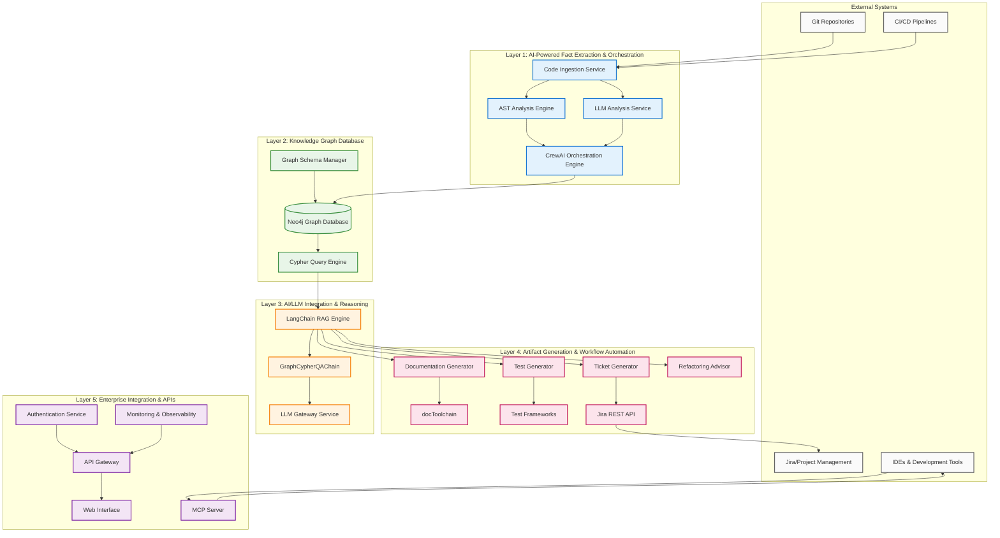

# AI-Assisted Software Engineering System - Design Document

## Overview

This design document outlines the architecture for an AI-assisted software engineering system that transforms traditional development workflows through knowledge graph-centric approaches. The system creates a "digital twin" of software systems using Neo4j graph databases, orchestrates AI agents with CrewAI, and provides intelligent automation through LangChain-powered RAG (Retrieval-Augmented Generation) workflows.

The architecture follows a four-layer design pattern optimized for scalability, modularity, and enterprise adoption, supporting both legacy system modernization and new application development workflows.

## Architecture

### High-Level System Architecture



### Technology Stack Selection

Based on comprehensive research and analysis of available tools, the following technology stack provides optimal performance, scalability, and maintainability:

#### Core Technologies
- **Graph Database**: Neo4j (market leader with excellent Cypher support and enterprise features)
- **AI Orchestration**: CrewAI (role-based multi-agent collaboration with delegation capabilities)
- **LLM Integration**: LangChain (comprehensive RAG support with GraphCypherQAChain)
- **Code Analysis**: CodeGraph Analyzer (direct Neo4j integration, multi-language support)
- **Documentation**: docToolchain + AsciiDoc (enterprise-grade documentation pipeline)

#### Supporting Technologies
- **Container Orchestration**: Kubernetes
- **Message Queue**: Apache Kafka
- **Caching**: Redis
- **Monitoring**: Prometheus + Grafana
- **Authentication**: Keycloak
- **API Gateway**: Kong

## Components and Interfaces

### Layer 1: AI-Powered Fact Extraction & Orchestration

#### Code Ingestion Service
**Purpose**: Monitors and ingests code changes from various sources
**Technology**: Python FastAPI service with Git webhooks
**Interfaces**:
- REST API for manual ingestion
- Webhook endpoints for Git repositories
- Message queue integration for async processing

```python
class CodeIngestionService:
    def ingest_repository(self, repo_url: str, branch: str = "main") -> IngestionJob
    def process_webhook(self, webhook_data: dict) -> None
    def get_ingestion_status(self, job_id: str) -> IngestionStatus
```

#### AST Analysis Engine
**Purpose**: Performs static code analysis using Abstract Syntax Trees
**Technology**: CodeGraph Analyzer with custom extensions
**Interfaces**:
- Direct Neo4j integration
- Support for Java, Python, JavaScript, C++, COBOL
- Incremental analysis capabilities

```python
class ASTAnalysisEngine:
    def analyze_files(self, file_paths: List[str]) -> List[CodeEntity]
    def extract_relationships(self, entities: List[CodeEntity]) -> List[Relationship]
    def update_graph(self, entities: List[CodeEntity], relationships: List[Relationship]) -> None
```

#### LLM Analysis Service
**Purpose**: Provides semantic understanding through Large Language Models
**Technology**: LangChain with multiple LLM providers (OpenAI, Anthropic, local models)
**Interfaces**:
- Code summarization
- Pattern detection
- Semantic relationship extraction

```python
class LLMAnalysisService:
    def summarize_code(self, code_snippet: str, context: dict) -> str
    def detect_patterns(self, code_entities: List[CodeEntity]) -> List[Pattern]
    def extract_semantic_relationships(self, code_context: str) -> List[SemanticRelationship]
```

#### CrewAI Orchestration Engine
**Purpose**: Coordinates multi-agent workflows for complex analysis tasks
**Technology**: CrewAI with custom agent definitions
**Interfaces**:
- Agent management and coordination
- Task delegation and execution
- Workflow state management

```python
class OrchestrationEngine:
    def create_analysis_crew(self, task_type: str) -> Crew
    def execute_workflow(self, crew: Crew, inputs: dict) -> WorkflowResult
    def monitor_progress(self, workflow_id: str) -> WorkflowStatus
```

### Layer 2: Knowledge Graph Database

#### Neo4j Graph Database
**Purpose**: Central repository for all code knowledge and relationships
**Technology**: Neo4j Enterprise with clustering support
**Schema Design**:

```cypher
// Core node types
CREATE CONSTRAINT FOR (f:File) REQUIRE f.path IS UNIQUE;
CREATE CONSTRAINT FOR (c:Class) REQUIRE (c.name, c.file_path) IS UNIQUE;
CREATE CONSTRAINT FOR (m:Method) REQUIRE (m.name, m.class_name, m.file_path) IS UNIQUE;

// Relationship types
(:File)-[:IMPORTS]->(:File)
(:Class)-[:EXTENDS]->(:Class)
(:Class)-[:IMPLEMENTS]->(:Interface)
(:Method)-[:CALLS]->(:Method)
(:Method)-[:USES]->(:Variable)
(:Component)-[:DEPENDS_ON]->(:Component)
```

#### Graph Schema Manager
**Purpose**: Manages graph schema evolution and validation
**Technology**: Custom Python service with Neo4j driver
**Interfaces**:
- Schema versioning and migration
- Constraint management
- Index optimization

```python
class GraphSchemaManager:
    def apply_migration(self, migration_script: str) -> MigrationResult
    def validate_schema(self) -> ValidationResult
    def optimize_indexes(self) -> OptimizationResult
```

### Layer 3: AI/LLM Integration & Reasoning

#### LangChain RAG Engine
**Purpose**: Provides intelligent query processing and response generation
**Technology**: LangChain with custom chains and retrievers
**Interfaces**:
- Natural language to Cypher translation
- Context-aware response generation
- Multi-modal knowledge retrieval

```python
class RAGEngine:
    def query_knowledge_graph(self, natural_language_query: str) -> QueryResult
    def generate_response(self, query_result: QueryResult, context: dict) -> str
    def explain_reasoning(self, query: str, result: QueryResult) -> Explanation
```

#### GraphCypherQAChain
**Purpose**: Specialized chain for graph database question answering
**Technology**: LangChain GraphCypherQAChain with custom prompts
**Configuration**:
- Custom Cypher generation prompts
- Result validation and error handling
- Query optimization

### Layer 4: Artifact Generation & Workflow Automation

#### Documentation Generator
**Purpose**: Generates and maintains architectural documentation
**Technology**: Custom Python service with docToolchain integration
**Interfaces**:
- arc42 template generation
- Diagram creation (Mermaid/PlantUML)
- Multi-format publishing

```python
class DocumentationGenerator:
    def generate_arc42_docs(self, project_id: str) -> DocumentationResult
    def create_architecture_diagrams(self, graph_query: str) -> List[Diagram]
    def publish_documentation(self, docs: Documentation, formats: List[str]) -> PublishResult
```

#### Test Generator
**Purpose**: Generates comprehensive test suites based on code analysis
**Technology**: Custom service with framework-specific templates
**Interfaces**:
- Unit test generation
- Integration test scenario identification
- Test coverage analysis

```python
class TestGenerator:
    def generate_unit_tests(self, method_info: MethodInfo) -> List[TestCase]
    def identify_integration_scenarios(self, component_graph: Graph) -> List[IntegrationScenario]
    def analyze_coverage_gaps(self, existing_tests: List[TestCase]) -> CoverageAnalysis
```

#### Ticket Generator
**Purpose**: Automatically creates and manages development tickets
**Technology**: Custom service with Jira REST API integration
**Interfaces**:
- Issue detection and classification
- Ticket creation with context
- Progress tracking and updates

```python
class TicketGenerator:
    def detect_issues(self, analysis_results: AnalysisResult) -> List[Issue]
    def create_jira_ticket(self, issue: Issue) -> JiraTicket
    def update_ticket_progress(self, ticket_id: str, progress: Progress) -> None
```

## Data Models

### Core Graph Entities

```python
from pydantic import BaseModel
from typing import List, Dict, Optional
from enum import Enum

class EntityType(Enum):
    FILE = "File"
    CLASS = "Class"
    METHOD = "Method"
    VARIABLE = "Variable"
    INTERFACE = "Interface"
    COMPONENT = "Component"

class CodeEntity(BaseModel):
    id: str
    type: EntityType
    name: str
    file_path: str
    line_number: Optional[int]
    properties: Dict[str, any]
    summary: Optional[str]
    complexity_score: Optional[float]

class Relationship(BaseModel):
    source_id: str
    target_id: str
    type: str
    properties: Dict[str, any]
    confidence_score: float

class AnalysisResult(BaseModel):
    entities: List[CodeEntity]
    relationships: List[Relationship]
    patterns: List[Pattern]
    issues: List[Issue]
    metrics: Dict[str, float]
```

### Workflow Models

```python
class WorkflowTask(BaseModel):
    id: str
    type: str
    description: str
    agent_role: str
    inputs: Dict[str, any]
    outputs: Dict[str, any]
    status: str
    created_at: datetime
    completed_at: Optional[datetime]

class AgentDefinition(BaseModel):
    role: str
    goal: str
    backstory: str
    tools: List[str]
    allow_delegation: bool
    memory_enabled: bool
```

## Error Handling

### Error Categories and Strategies

#### 1. Code Analysis Errors
- **Parsing Failures**: Graceful degradation with partial analysis
- **Language Support**: Clear error messages for unsupported languages
- **Large File Handling**: Chunking and streaming for large codebases

#### 2. Graph Database Errors
- **Connection Issues**: Automatic retry with exponential backoff
- **Schema Violations**: Validation before insertion with detailed error reporting
- **Performance Issues**: Query optimization and caching strategies

#### 3. LLM Integration Errors
- **Rate Limiting**: Queue management and request throttling
- **Model Failures**: Fallback to alternative models or cached responses
- **Context Window Limits**: Intelligent context truncation and summarization

#### 4. Multi-Agent Workflow Errors
- **Agent Communication**: Timeout handling and retry mechanisms
- **Task Failures**: Automatic task reassignment and error escalation
- **Resource Conflicts**: Coordination mechanisms and resource locking

### Error Recovery Mechanisms

```python
class ErrorHandler:
    def handle_analysis_error(self, error: AnalysisError) -> RecoveryAction
    def handle_graph_error(self, error: GraphError) -> RecoveryAction
    def handle_llm_error(self, error: LLMError) -> RecoveryAction
    def handle_workflow_error(self, error: WorkflowError) -> RecoveryAction

class RecoveryAction(BaseModel):
    action_type: str
    retry_count: int
    fallback_strategy: Optional[str]
    escalation_required: bool
```

## Testing Strategy

### Unit Testing
- **Component Isolation**: Mock external dependencies (Neo4j, LLMs, APIs)
- **Test Coverage**: Minimum 80% code coverage for core components
- **Property-Based Testing**: Use Hypothesis for complex data transformations

### Integration Testing
- **Graph Database**: Test schema migrations and query performance
- **LLM Integration**: Test with mock LLM responses and real API calls
- **Multi-Agent Workflows**: Test agent coordination and task delegation

### End-to-End Testing
- **Full Pipeline**: Test complete workflows from code ingestion to artifact generation
- **Performance Testing**: Load testing with realistic codebases
- **Regression Testing**: Automated testing of core functionality

### Testing Infrastructure

```python
class TestInfrastructure:
    def setup_test_graph_db(self) -> Neo4jTestInstance
    def create_mock_llm_service(self) -> MockLLMService
    def setup_test_repositories(self) -> List[TestRepository]
    def run_performance_benchmarks(self) -> BenchmarkResults
```

## Security Considerations

### Authentication and Authorization
- **Enterprise SSO**: Integration with SAML/OIDC providers
- **Role-Based Access Control**: Fine-grained permissions for graph access
- **API Security**: JWT tokens with proper validation and expiration

### Data Protection
- **Sensitive Data Detection**: Automatic PII identification and masking
- **Encryption**: At-rest and in-transit encryption for all data
- **Audit Logging**: Comprehensive audit trails for all system interactions

### Code Security
- **Vulnerability Scanning**: Integration with security scanning tools
- **Dependency Analysis**: Automated dependency vulnerability detection
- **Secure Coding**: Security-focused code analysis and recommendations

### Compliance
- **GDPR Compliance**: Data retention policies and right to deletion
- **SOC 2**: Security controls and monitoring
- **Industry Standards**: Compliance with relevant industry regulations

## Performance Optimization

### Graph Database Optimization
- **Index Strategy**: Optimized indexes for common query patterns
- **Query Optimization**: Cypher query performance tuning
- **Clustering**: Multi-node Neo4j clusters for high availability

### LLM Performance
- **Caching**: Intelligent caching of LLM responses
- **Batch Processing**: Batch API calls for efficiency
- **Model Selection**: Optimal model selection based on task requirements

### Scalability Patterns
- **Horizontal Scaling**: Microservices architecture with load balancing
- **Async Processing**: Message queues for long-running tasks
- **Resource Management**: Dynamic resource allocation based on workload

## Deployment Architecture

### Container Strategy
```yaml
# Docker Compose example for development
version: '3.8'
services:
  neo4j:
    image: neo4j:5.15-enterprise
    environment:
      NEO4J_AUTH: neo4j/password
      NEO4J_PLUGINS: '["apoc", "graph-data-science"]'
    
  api-gateway:
    image: kong:3.4
    environment:
      KONG_DATABASE: "off"
      KONG_DECLARATIVE_CONFIG: /kong/kong.yml
    
  orchestration-engine:
    build: ./services/orchestration
    environment:
      NEO4J_URI: bolt://neo4j:7687
      OPENAI_API_KEY: ${OPENAI_API_KEY}
    
  documentation-generator:
    build: ./services/documentation
    volumes:
      - ./output:/app/output
```

### Kubernetes Deployment
```yaml
apiVersion: apps/v1
kind: Deployment
metadata:
  name: ai-software-engineering-system
spec:
  replicas: 3
  selector:
    matchLabels:
      app: ai-software-engineering
  template:
    metadata:
      labels:
        app: ai-software-engineering
    spec:
      containers:
      - name: orchestration-engine
        image: ai-software-engineering/orchestration:latest
        resources:
          requests:
            memory: "2Gi"
            cpu: "1000m"
          limits:
            memory: "4Gi"
            cpu: "2000m"
```

This design provides a comprehensive, scalable, and maintainable architecture for the AI-assisted software engineering system, leveraging best-in-class technologies and patterns for enterprise deployment.