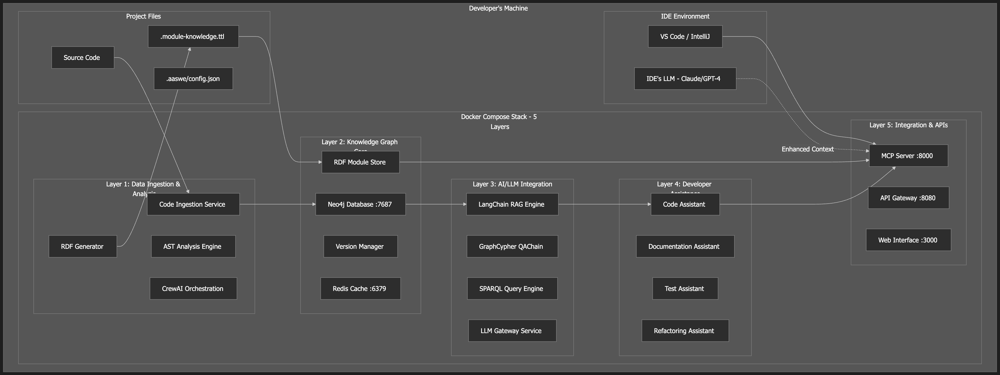

# AIDe

AI-Assisted Software Engineering with enhanced IDE LLM context through knowledge graphs.

## Overview

AIDe analyzes codebases to create comprehensive knowledge graphs that enhance LLM interactions in your IDE. It combines Abstract Syntax Tree (AST) analysis with business context to provide intelligent code assistance.

## Quick Start

```bash
npm install -g @aide/codebase-ai
aide init
aide start
```

## Features

- **Deep Code Analysis**: AST parsing with semantic relationship mapping
- **Knowledge Graph**: Neo4j-powered graph database for complex queries
- **IDE Integration**: Model Context Protocol (MCP) for seamless LLM enhancement
- **Local-First**: Complete Docker-based stack runs locally
- **Multi-Language**: TypeScript, JavaScript, Python, Java support
- **Business Context**: RDF/TTL files for domain knowledge

## Architecture


 


## Installation

### Prerequisites

- Node.js ≥18.0.0
- Docker & Docker Compose
- Git (recommended)

### Global Installation

```bash
npm install -g @aide/codebase-ai
```

### Project Setup

```bash
cd your-project
aide init
aide start
```

## Usage

### CLI Commands

```bash
aide init                    # Initialize project
aide start                   # Start services
aide stop                    # Stop services  
aide status                  # Service status
aide logs [-f] [-s service]  # View logs
aide analyze [--incremental] # Analyze codebase
```

### Programmatic API

```typescript
import { AIDe } from '@aide/codebase-ai';

const aide = new AIDe({
  projectPath: './my-project',
  autoStart: true
});

await aide.start();
const result = await aide.analyze({ incremental: true });
```

### Business Context

Add `.module-knowledge.ttl` files for domain knowledge:

```turtle
@prefix aide: <http://aide.dev/ontology#> .

aide:UserModule a aide:Module ;
    aide:purpose "User authentication and management" ;
    aide:criticality "high" ;
    aide:maintainer "auth-team@company.com" .
```

## Configuration

Environment variables in `.env`:

```bash
# Database
NEO4J_URI=bolt://localhost:7687
REDIS_URL=redis://localhost:6379

# LLM Providers
OPENAI_API_KEY=your-key
ANTHROPIC_API_KEY=your-key

# Analysis
ANALYSIS_ENABLED=true
SUPPORTED_LANGUAGES=typescript,javascript,python,java
```

## Development

### Build from Source

```bash
git clone https://github.com/aide/codebase-ai.git
cd codebase-ai
npm install
npm run build
```

### Testing

```bash
npm test                # Run tests
npm run test:watch      # Watch mode
npm run test:coverage   # Coverage report
```

### Docker Services

```bash
npm run docker:up       # Start stack
npm run docker:down     # Stop stack
npm run docker:logs     # View logs
npm run docker:status   # Service status
```

## Service Endpoints

| Service | Port | Description |
|---------|------|-------------|
| Neo4j Browser | 7474 | Graph database UI |
| Web Interface | 3000 | Management dashboard |
| API Gateway | 8080 | REST API |
| MCP Server | 8000 | IDE integration |

## Contributing

1. Fork the repository
2. Create feature branch: `git checkout -b feature-name`
3. Commit changes: `git commit -am 'Add feature'`
4. Push branch: `git push origin feature-name`
5. Submit pull request

## License

MIT License. See [LICENSE](LICENSE) for details.

## Support

- **Issues**: [GitHub Issues](https://github.com/aide/codebase-ai/issues)
- **Documentation**: [Wiki](https://github.com/aide/codebase-ai/wiki)
- **Discussions**: [GitHub Discussions](https://github.com/aide/codebase-ai/discussions)

---

Built with ❤️ for developers who want intelligent code assistance.