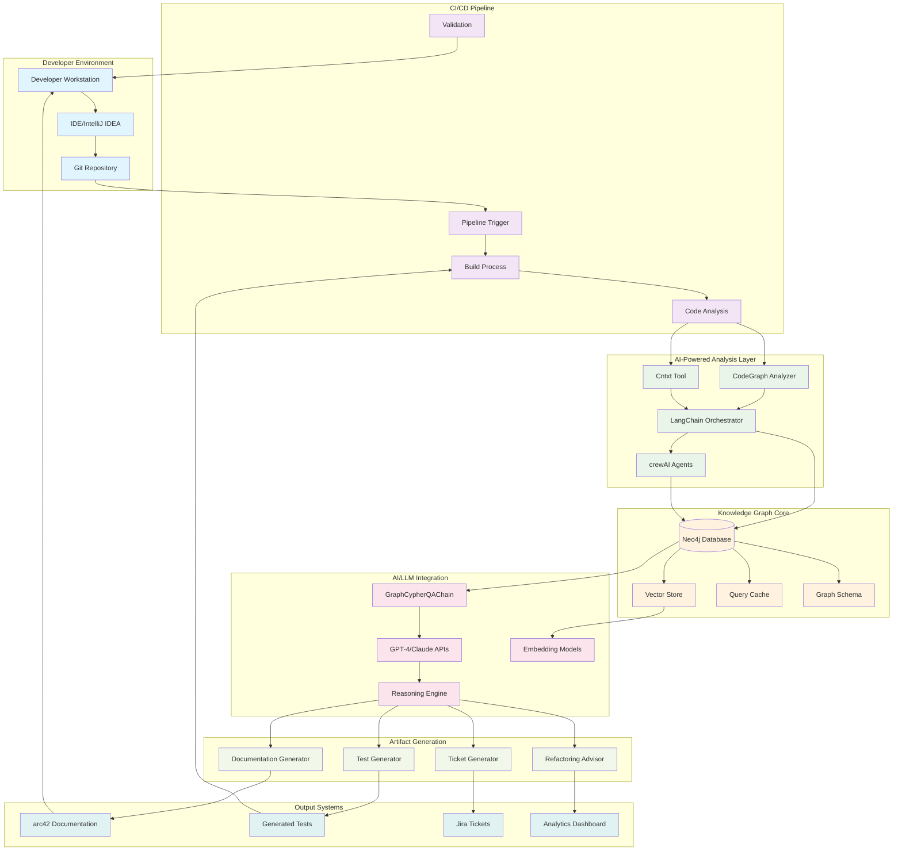
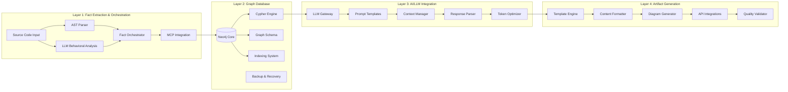
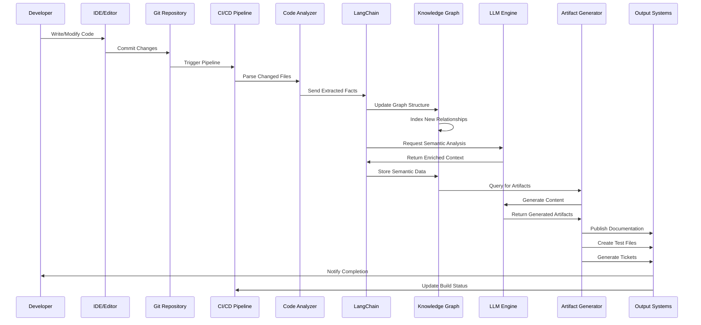
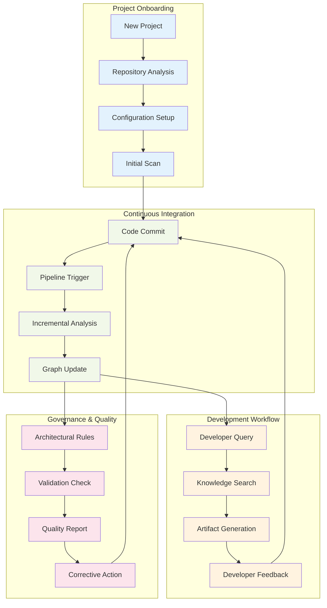
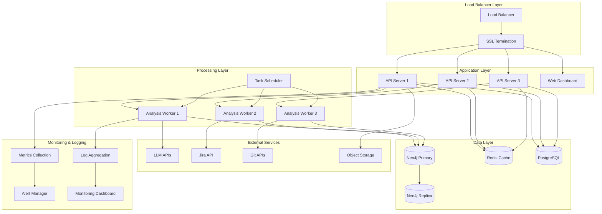
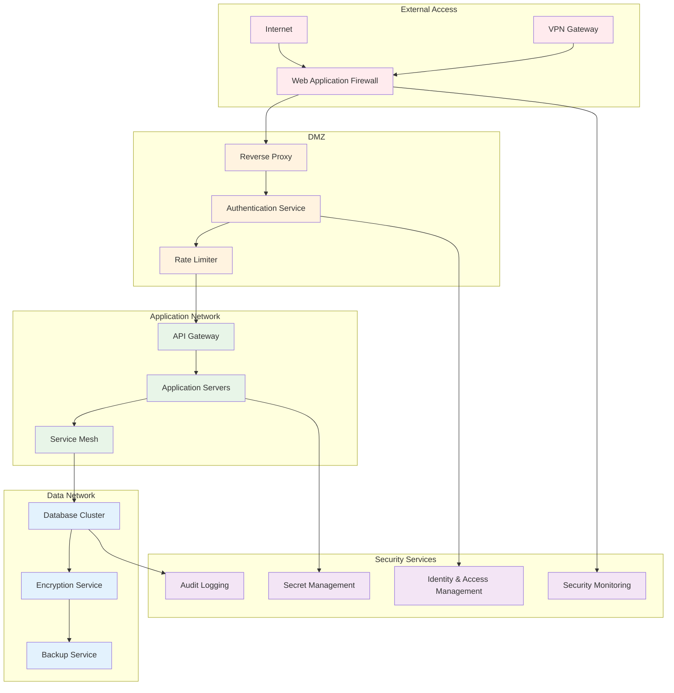
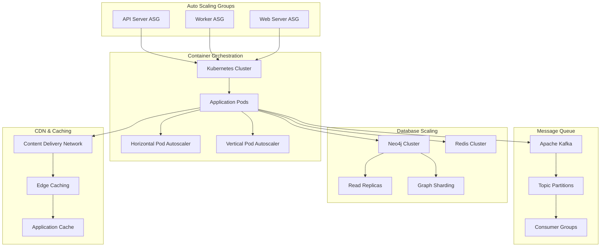
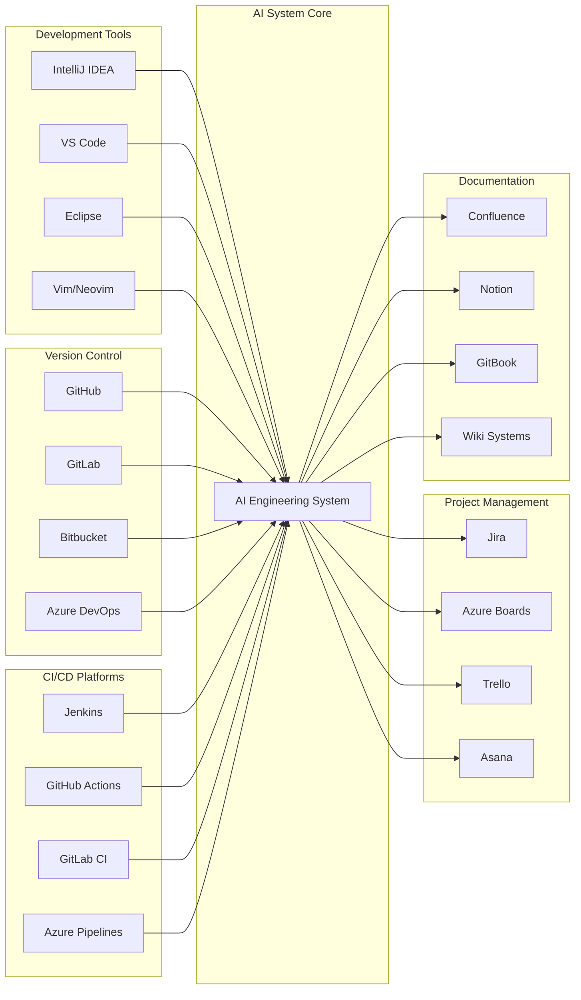
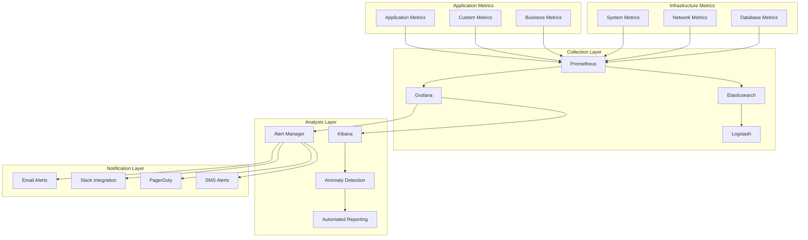

# AI-Assisted Software Engineering System: Architecture Diagrams

## Overview

This document provides detailed architectural diagrams for the AI-assisted software engineering system, showing how different components interact and how projects integrate with the system.

## 1. High-Level System Architecture



## 2. Detailed Component Architecture



## 3. Data Flow Architecture



## 4. Knowledge Graph Schema

```mermaid
erDiagram
    PROJECT ||--o{ MODULE : contains
    MODULE ||--o{ COMPONENT : contains
    COMPONENT ||--o{ CLASS : contains
    CLASS ||--o{ METHOD : contains
    CLASS ||--o{ FIELD : contains
    METHOD ||--o{ PARAMETER : has
    METHOD ||--o{ VARIABLE : uses
    
    PROJECT {
        string name
        string version
        string description
        datetime created_at
        string repository_url
    }
    
    MODULE {
        string name
        string path
        string language
        int lines_of_code
        string summary
    }
    
    COMPONENT {
        string name
        string type
        string layer
        string responsibility
        int complexity_score
    }
    
    CLASS {
        string name
        string access_modifier
        boolean is_abstract
        int method_count
        int field_count
        string summary
    }
    
    METHOD {
        string name
        string return_type
        string access_modifier
        int cyclomatic_complexity
        int lines_of_code
        string summary
    }
    
    FIELD {
        string name
        string type
        string access_modifier
        boolean is_static
        boolean is_final
    }
    
    PARAMETER {
        string name
        string type
        boolean is_optional
        string default_value
    }
    
    VARIABLE {
        string name
        string type
        string scope
        int usage_count
    }
    
    %% Relationships
    CLASS ||--o{ CLASS : EXTENDS
    CLASS ||--o{ CLASS : IMPLEMENTS
    METHOD ||--o{ METHOD : CALLS
    COMPONENT ||--o{ COMPONENT : DEPENDS_ON
    MODULE ||--o{ MODULE : IMPORTS
```

## 5. Project Integration Workflow



## 6. Deployment Architecture



## 7. Security Architecture



## 8. Scalability Architecture



## 9. Integration Points



## 10. Performance Monitoring Architecture



## Summary

These architectural diagrams provide a comprehensive view of the AI-assisted software engineering system, showing:

1. **High-level system architecture** with all major components and their interactions
2. **Detailed component breakdown** for each layer of the system
3. **Data flow sequences** showing how information moves through the system
4. **Knowledge graph schema** defining the structure of stored code intelligence
5. **Project integration workflows** demonstrating how projects onboard and operate
6. **Deployment architecture** for production environments
7. **Security architecture** ensuring data protection and access control
8. **Scalability architecture** for handling enterprise-scale workloads
9. **Integration points** with existing development tools and platforms
10. **Performance monitoring** for system health and optimization

The architecture is designed to be modular, scalable, and secure, supporting the phased implementation approach outlined in the main implementation plan.