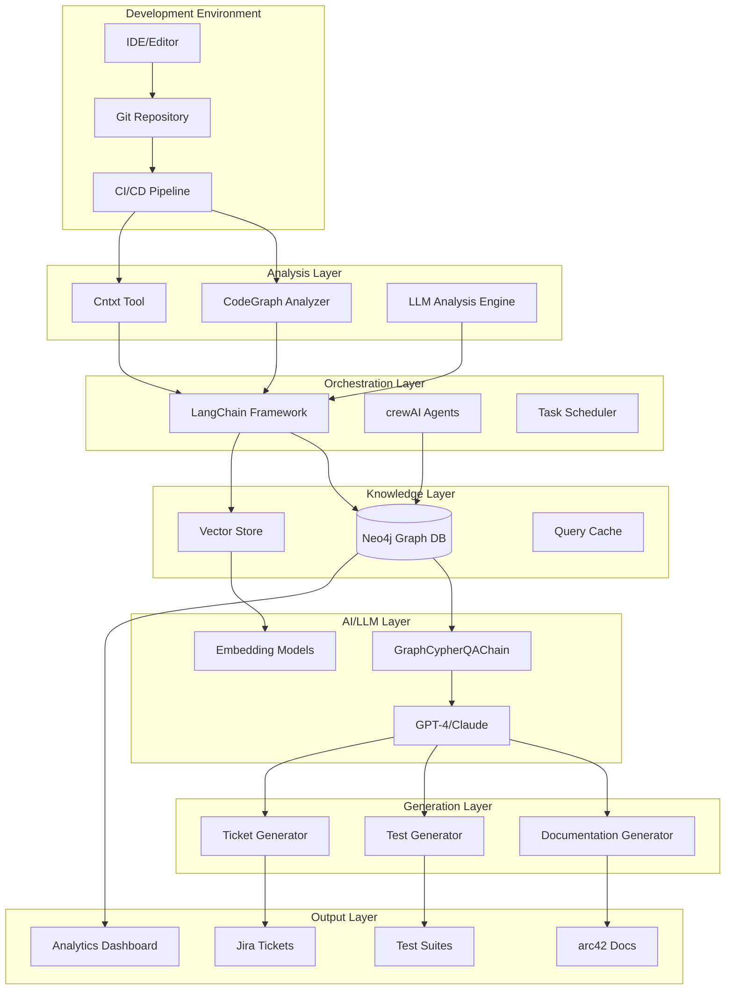
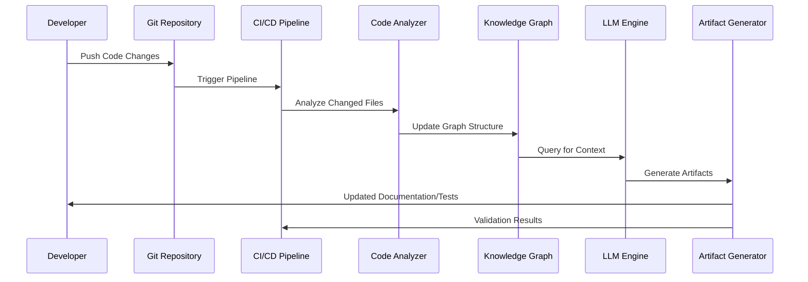

# AI-Assisted Software Engineering System: Deep Research & Implementation Plan

## Executive Summary

Based on the comprehensive analysis of your presentation and architecture draft, this document provides a concrete implementation plan for building an AI-powered software engineering system that transforms codebases into queryable knowledge graphs, enabling automated development workflows, documentation generation, and architectural governance.

## 1. System Architecture Analysis

### Core Architecture Overview
The system follows a 4-layer architecture:

1. **AI-Powered Fact Extraction & Orchestration Layer**
2. **Graph Database Layer (Neo4j)**
3. **AI/LLM Integration & Reasoning Layer**
4. **Artifact Generation & Workflow Automation Layer**

### Key Components Deep Dive

#### Layer 1: Fact Extraction & Orchestration
- **Primary Tools**: LangChain, crewAI, CodeGraph Analyzer, Cntxt
- **Function**: Hybrid analysis combining AST parsing with LLM behavioral analysis
- **Output**: Structured facts and relationships for knowledge graph construction

#### Layer 2: Graph Database
- **Technology**: Neo4j with Cypher query language
- **Function**: Central repository storing code entities, relationships, and metadata
- **Benefits**: Queryable codebase representation, relationship traversal, pattern detection

#### Layer 3: AI/LLM Integration
- **Technologies**: GPT-4/Claude, GraphCypherQAChain, LangChain RAG
- **Function**: Natural language to Cypher translation, semantic enrichment
- **Capability**: Context-aware code analysis and reasoning

#### Layer 4: Artifact Generation
- **Technologies**: docToolchain, AsciiDoc, Mermaid/PlantUML, Jira REST API
- **Function**: Automated generation of documentation, tests, and project management artifacts
- **Output**: arc42 documentation, unit tests, integration tests, Jira tickets

## 2. Current Tools Analysis & Recommendations

### 2.1 Graph Database Solutions

#### Neo4j (Recommended)
**Strengths:**
- Market leader in graph databases
- Mature Cypher query language
- Excellent performance for relationship queries
- Strong ecosystem and community support
- Direct integration with analysis tools

**Implementation Considerations:**
- Requires dedicated infrastructure
- Learning curve for Cypher
- Licensing costs for enterprise features

**Alternative Options:**
- Amazon Neptune (cloud-native)
- ArangoDB (multi-model)
- TigerGraph (high-performance analytics)

### 2.2 Code Analysis Tools

#### CodeGraph Analyzer (Primary Recommendation)
**Strengths:**
- Direct Neo4j integration
- Multi-language support (C++, Java, Python, etc.)
- MCP server for IDE integration
- Handles complex language constructs

**Use Cases:**
- Initial codebase ingestion
- Continuous CI/CD integration
- Complex language parsing (C++, COBOL)

#### Cntxt (Secondary/Complementary)
**Strengths:**
- Token usage reduction (up to 75%)
- Lightweight knowledge graph generation
- Optimized for LLM context windows
- Cost-effective for large codebases

**Use Cases:**
- LLM context optimization
- Large codebase analysis
- Token cost reduction

#### Additional Tools to Consider:
- **Sourcegraph**: Code search and intelligence
- **GitHub CodeQL**: Security-focused code analysis
- **SonarQube**: Code quality and security analysis
- **Understand**: Static code analysis and metrics

### 2.3 LLM Orchestration Frameworks

#### LangChain (Primary Recommendation)
**Strengths:**
- Comprehensive RAG support
- GraphCypherQAChain for text-to-Cypher translation
- Extensive LLM integrations
- Active development and community

**Key Components:**
- Document loaders and text splitters
- Vector stores and retrievers
- Chain abstractions for complex workflows
- Agent framework for autonomous tasks

#### crewAI (Multi-Agent Systems)
**Strengths:**
- Role-based agent design
- Hierarchical task delegation
- Autonomous collaboration
- Specialized for software engineering tasks

**Use Cases:**
- Complex analysis workflows
- Code review automation
- Multi-step development tasks

#### Alternative Frameworks:
- **AutoGen**: Microsoft's multi-agent framework
- **LlamaIndex**: Advanced data ingestion and indexing
- **Haystack**: End-to-end NLP framework

### 2.4 Documentation Generation Tools

#### docToolchain (Recommended)
**Strengths:**
- AsciiDoc processing
- Multiple output formats (HTML, PDF, Confluence)
- Diagram integration (Mermaid, PlantUML)
- arc42 template support

#### Alternative Solutions:
- **GitBook**: Modern documentation platform
- **Sphinx**: Python-based documentation generator
- **MkDocs**: Markdown-based static site generator

## 3. Concrete Implementation Plan

### Phase 1: Foundation & Proof of Concept (Months 1-3)

#### Objectives:
- Establish core infrastructure
- Demonstrate value with legacy system analysis
- Generate first automated documentation

#### Technical Setup:
1. **Infrastructure Deployment**
   ```bash
   # Neo4j deployment (Docker)
   docker run -d \
     --name neo4j \
     -p 7474:7474 -p 7687:7687 \
     -e NEO4J_AUTH=neo4j/password \
     neo4j:latest
   ```

2. **Python Environment Setup**
   ```bash
   pip install langchain neo4j openai python-dotenv
   pip install codeql-analyzer  # or equivalent
   ```

3. **Core Components Implementation**
   - Neo4j database setup and configuration
   - LangChain integration with Neo4j driver
   - Basic fact extraction pipeline
   - Simple query interface

#### Deliverables:
- Working Neo4j instance with sample data
- Basic code-to-graph pipeline
- Simple natural language query interface
- Initial arc42 documentation generation

#### Success Metrics:
- Successfully parse and load 10,000+ lines of code
- Generate basic architectural documentation
- Demonstrate 60%+ accuracy in dependency detection

### Phase 2: Integration & Governance (Months 4-6)

#### Objectives:
- CI/CD pipeline integration
- Automated architectural governance
- Real-time knowledge graph updates

#### Technical Implementation:
1. **CI/CD Integration**
   ```yaml
   # GitHub Actions example
   name: Knowledge Graph Update
   on: [push, pull_request]
   jobs:
     update-kg:
       runs-on: ubuntu-latest
       steps:
         - uses: actions/checkout@v2
         - name: Analyze Code Changes
           run: python scripts/analyze_changes.py
         - name: Update Knowledge Graph
           run: python scripts/update_neo4j.py
   ```

2. **Architectural Governance Rules**
   ```cypher
   // Example: Detect layer violations
   MATCH (ui:Component {layer:'UI'})-[:CALLS]->(db:Component {layer:'DataAccess'})
   RETURN ui.name AS Violation, db.name AS IllegalDependency
   ```

#### Deliverables:
- Automated CI/CD integration
- Architectural rule validation
- Real-time knowledge graph updates
- Governance dashboard

#### Success Metrics:
- 100% CI/CD integration success rate
- Zero architectural violations in new code
- <5 minute analysis time for typical commits

### Phase 3: Full Automation & Workflow Integration (Months 7-9)

#### Objectives:
- Complete artifact generation automation
- AI-powered test generation
- Jira workflow integration

#### Technical Implementation:
1. **Advanced Documentation Generation**
   ```python
   # arc42 generation pipeline
   def generate_arc42_documentation():
       sections = {
           'building_blocks': query_building_blocks(),
           'runtime_view': query_runtime_flows(),
           'deployment_view': query_deployment_info()
       }
       return render_arc42_template(sections)
   ```

2. **AI Test Generation**
   ```python
   # Test generation workflow
   def generate_unit_tests(function_node):
       context = extract_function_context(function_node)
       prompt = create_test_generation_prompt(context)
       test_code = llm.generate(prompt)
       return format_test_file(test_code)
   ```

3. **Jira Integration**
   ```python
   # Automated ticket creation
   def create_technical_debt_ticket(issue_data):
       jira_payload = {
           'fields': {
               'project': {'key': 'TECH'},
               'summary': issue_data['title'],
               'description': issue_data['context'],
               'assignee': {'name': issue_data['owner']}
           }
       }
       return jira_client.create_issue(jira_payload)
   ```

#### Deliverables:
- Complete arc42 documentation automation
- AI-powered test generation
- Automated Jira ticket creation
- Performance monitoring dashboard

#### Success Metrics:
- 90%+ documentation accuracy
- 80%+ test coverage from generated tests
- <1 hour mean time to ticket creation

### Phase 4: Scale & Enterprise Adoption (Months 10-12)

#### Objectives:
- Multi-project knowledge graph
- Enterprise-wide rollout
- Center of excellence establishment

#### Technical Implementation:
1. **Unified Enterprise Graph**
   ```cypher
   // Cross-project dependency analysis
   MATCH (p1:Project)-[:DEPENDS_ON]->(p2:Project)
   RETURN p1.name, collect(p2.name) AS Dependencies
   ```

2. **Scalability Optimizations**
   - Graph partitioning strategies
   - Incremental update optimizations
   - Caching layers for frequent queries

#### Deliverables:
- Enterprise knowledge graph
- Multi-team training program
- Best practices documentation
- Success metrics dashboard

#### Success Metrics:
- 50+ projects onboarded
- 90%+ developer satisfaction
- 40%+ reduction in documentation time

## 4. Detailed Technical Architecture

### 4.1 System Components Diagram



### 4.2 Data Flow Architecture



## 5. Technology Stack Recommendations

### 5.1 Core Infrastructure

| Component | Primary Choice | Alternative | Rationale |
|-----------|---------------|-------------|-----------|
| Graph Database | Neo4j | Amazon Neptune | Market leader, mature ecosystem |
| LLM Framework | LangChain | LlamaIndex | Comprehensive RAG support |
| Code Analysis | CodeGraph Analyzer | Sourcegraph | Direct Neo4j integration |
| Documentation | docToolchain | GitBook | arc42 template support |
| CI/CD Integration | GitHub Actions | Jenkins | Cloud-native, easy setup |

### 5.2 Development Stack

```yaml
Backend:
  - Python 3.9+
  - FastAPI for REST APIs
  - Neo4j Python Driver
  - LangChain framework
  - OpenAI/Anthropic APIs

Frontend:
  - React/Next.js for dashboard
  - D3.js for graph visualization
  - Material-UI components

Infrastructure:
  - Docker containers
  - Kubernetes orchestration
  - Redis for caching
  - PostgreSQL for metadata
```

## 6. Deployment Strategy

### 6.1 Cloud Deployment Options

#### Option 1: AWS-based Deployment
```yaml
Services:
  - EC2 instances for Neo4j
  - EKS for application containers
  - S3 for artifact storage
  - Lambda for serverless functions
  - API Gateway for REST APIs
```

#### Option 2: Azure-based Deployment
```yaml
Services:
  - Azure VMs for Neo4j
  - AKS for containers
  - Blob Storage for artifacts
  - Functions for serverless
  - API Management
```

#### Option 3: On-Premises Deployment
```yaml
Components:
  - Docker Swarm/Kubernetes
  - Local Neo4j cluster
  - Internal load balancers
  - Private container registry
```

### 6.2 Security Considerations

1. **Data Protection**
   - Encryption at rest and in transit
   - Access control and authentication
   - API key management
   - Code repository security

2. **Network Security**
   - VPC/VNET isolation
   - Firewall rules
   - SSL/TLS certificates
   - Network monitoring

3. **Compliance**
   - GDPR compliance for EU operations
   - SOC 2 Type II certification
   - Regular security audits
   - Data retention policies

## 7. Cost Analysis & ROI Projections

### 7.1 Implementation Costs (Year 1)

| Category | Cost Range | Notes |
|----------|------------|-------|
| Infrastructure | $50K-100K | Cloud services, Neo4j licensing |
| Development Team | $300K-500K | 3-5 engineers for 12 months |
| LLM API Costs | $20K-50K | Based on usage volume |
| Tools & Licenses | $10K-25K | Various software licenses |
| **Total** | **$380K-675K** | Initial implementation |

### 7.2 Operational Costs (Annual)

| Category | Cost Range | Notes |
|----------|------------|-------|
| Infrastructure | $60K-120K | Ongoing cloud/licensing costs |
| Maintenance Team | $200K-300K | 2-3 engineers |
| LLM API Costs | $30K-80K | Production usage |
| **Total** | **$290K-500K** | Annual operational costs |

### 7.3 ROI Projections

Based on the presentation metrics:
- **60% accuracy improvement** in code analysis
- **6 weeks to 2 weeks** reduction in analysis time
- **60,000 person-days saved** across enterprise

**Conservative ROI Calculation:**
- Average developer cost: $150K/year
- Time savings: 20% per developer
- For 100 developers: $3M annual savings
- **ROI: 400-600% in Year 2**

## 8. Risk Assessment & Mitigation

### 8.1 Technical Risks

| Risk | Impact | Probability | Mitigation |
|------|--------|-------------|------------|
| LLM API reliability | High | Medium | Multi-provider strategy, local models |
| Neo4j performance | High | Low | Proper indexing, query optimization |
| Integration complexity | Medium | High | Phased rollout, extensive testing |
| Data quality issues | Medium | Medium | Validation pipelines, monitoring |

### 8.2 Business Risks

| Risk | Impact | Probability | Mitigation |
|------|--------|-------------|------------|
| Developer adoption | High | Medium | Training, change management |
| Budget overruns | Medium | Medium | Phased approach, regular reviews |
| Competitive solutions | Low | High | Continuous innovation, differentiation |

## 9. Success Metrics & KPIs

### 9.1 Technical Metrics

- **Code Analysis Accuracy**: >90%
- **Documentation Coverage**: >95%
- **System Uptime**: >99.9%
- **Query Response Time**: <2 seconds
- **CI/CD Integration Success**: >99%

### 9.2 Business Metrics

- **Developer Productivity**: +30%
- **Documentation Time Reduction**: -60%
- **Bug Detection Rate**: +40%
- **Time to Market**: -25%
- **Technical Debt Reduction**: -50%

### 9.3 User Experience Metrics

- **Developer Satisfaction**: >4.5/5
- **System Adoption Rate**: >80%
- **Training Completion**: >90%
- **Support Ticket Volume**: <10/month

## 10. Next Steps & Action Items

### Immediate Actions (Next 30 Days)
1. **Team Assembly**
   - Hire/assign technical lead
   - Identify development team members
   - Establish project governance

2. **Infrastructure Planning**
   - Choose cloud provider
   - Design network architecture
   - Plan security implementation

3. **Pilot Project Selection**
   - Identify legacy system for Phase 1
   - Assess codebase complexity
   - Define success criteria

### Short-term Goals (Next 90 Days)
1. **Phase 1 Implementation**
   - Deploy Neo4j infrastructure
   - Implement basic analysis pipeline
   - Create initial documentation

2. **Stakeholder Engagement**
   - Present plan to leadership
   - Gather developer feedback
   - Establish communication channels

### Long-term Objectives (Next 12 Months)
1. **Full System Deployment**
   - Complete all 4 phases
   - Achieve enterprise adoption
   - Establish center of excellence

2. **Continuous Improvement**
   - Monitor performance metrics
   - Gather user feedback
   - Plan future enhancements

## Conclusion

This AI-assisted software engineering system represents a transformative approach to software development, offering significant improvements in productivity, quality, and maintainability. The phased implementation plan provides a structured path to adoption while minimizing risk and maximizing value delivery.

The combination of knowledge graphs, AI-powered analysis, and automated artifact generation creates a powerful platform that can revolutionize how organizations develop and maintain software systems. With proper implementation and adoption, this system can deliver substantial ROI while improving developer experience and software quality.

The key to success lies in careful planning, phased rollout, and strong change management to ensure developer adoption and maximize the system's potential impact on your organization's software engineering capabilities.