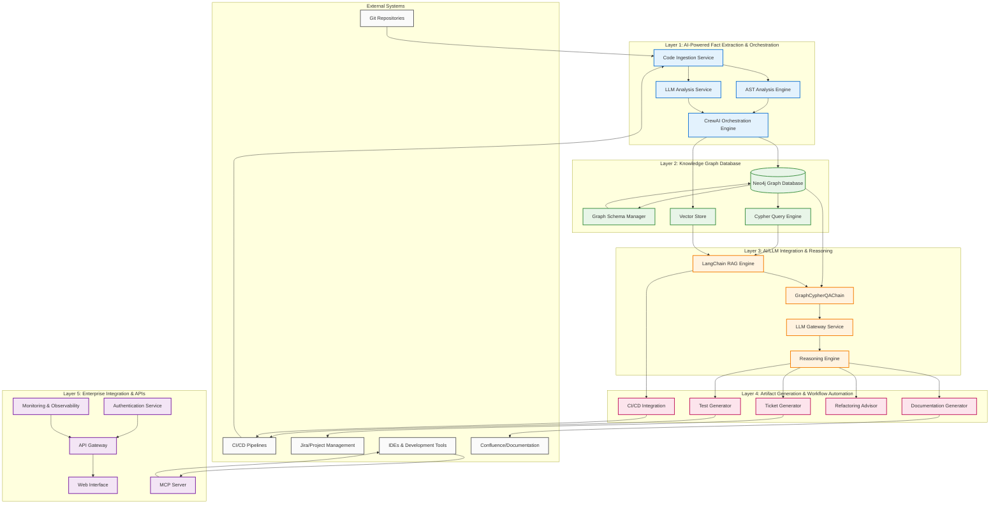
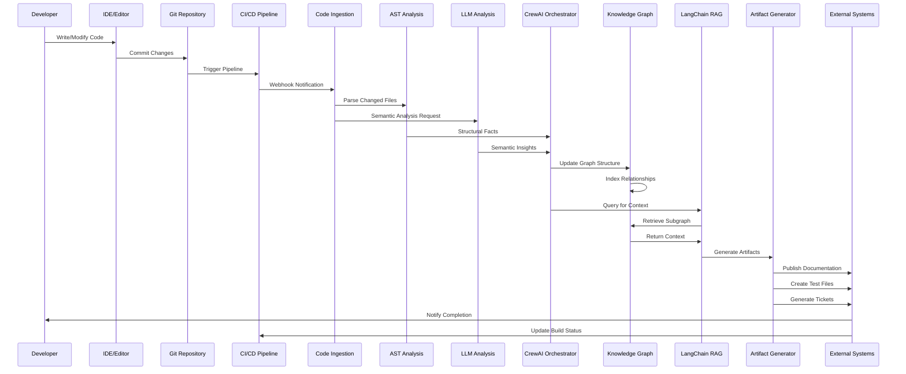
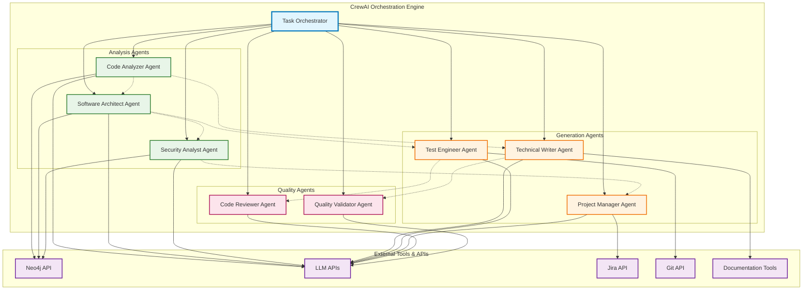
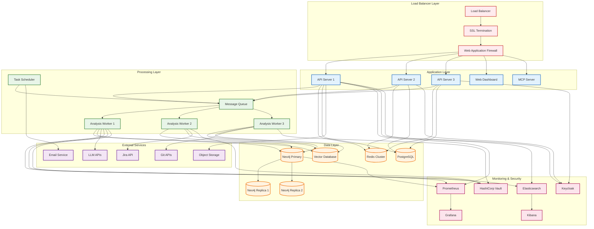
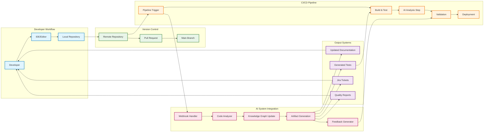
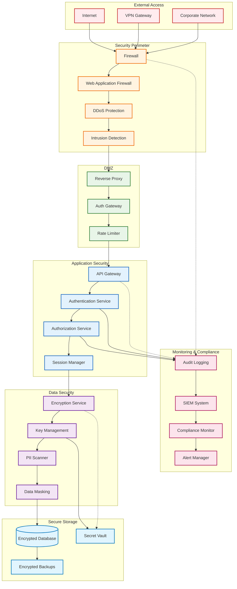
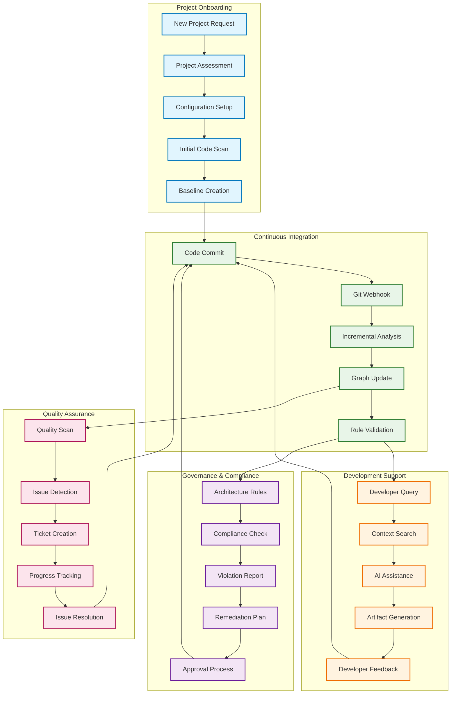

# AI-Assisted Software Engineering System: Comprehensive System Diagrams

## 1. High-Level System Architecture



## 2. Data Flow Architecture



## 3. CrewAI Multi-Agent Architecture



## 4. Knowledge Graph Schema Visualization

```mermaid
erDiagram
    PROJECT ||--o{ MODULE : contains
    MODULE ||--o{ COMPONENT : contains
    COMPONENT ||--o{ CLASS : contains
    CLASS ||--o{ METHOD : contains
    CLASS ||--o{ FIELD : contains
    METHOD ||--o{ PARAMETER : has
    METHOD ||--o{ VARIABLE : uses
    
    PROJECT {
        string name PK
        string version
        string description
        datetime created_at
        string repository_url
        string main_language
        int total_lines_of_code
    }
    
    MODULE {
        string id PK
        string name
        string path
        string language
        int lines_of_code
        string summary
        float complexity_score
        datetime last_modified
    }
    
    COMPONENT {
        string id PK
        string name
        string type
        string layer
        string responsibility
        int complexity_score
        string summary
        list dependencies
    }
    
    CLASS {
        string id PK
        string name
        string full_name
        string access_modifier
        boolean is_abstract
        boolean is_interface
        int method_count
        int field_count
        string summary
        float complexity_score
    }
    
    METHOD {
        string id PK
        string name
        string signature
        string return_type
        string access_modifier
        int cyclomatic_complexity
        int lines_of_code
        string summary
        boolean is_static
        boolean is_constructor
    }
    
    FIELD {
        string id PK
        string name
        string type
        string access_modifier
        boolean is_static
        boolean is_final
        string default_value
    }
    
    PARAMETER {
        string id PK
        string name
        string type
        boolean is_optional
        string default_value
        int position
    }
    
    VARIABLE {
        string id PK
        string name
        string type
        string scope
        int usage_count
        boolean is_local
    }
    
    %% Additional relationships
    CLASS ||--o{ CLASS : EXTENDS
    CLASS ||--o{ CLASS : IMPLEMENTS
    METHOD ||--o{ METHOD : CALLS
    METHOD ||--o{ METHOD : OVERRIDES
    COMPONENT ||--o{ COMPONENT : DEPENDS_ON
    MODULE ||--o{ MODULE : IMPORTS
    CLASS ||--o{ CLASS : AGGREGATES
    CLASS ||--o{ CLASS : COMPOSES
```

## 5. Deployment Architecture



## 6. CI/CD Integration Flow



## 7. Security Architecture



## 8. Project Integration Workflow



## Summary

These comprehensive diagrams provide a complete visual representation of the AI-assisted software engineering system, covering:

1. **High-Level Architecture**: Shows the 5-layer system design with all components and connections
2. **Data Flow**: Illustrates how information moves through the system from code changes to artifact generation
3. **Multi-Agent Architecture**: Details the CrewAI orchestration and agent collaboration patterns
4. **Knowledge Graph Schema**: Visualizes the entity-relationship model for code representation
5. **Deployment Architecture**: Shows the production infrastructure and scaling patterns
6. **CI/CD Integration**: Demonstrates how the system integrates with development workflows
7. **Security Architecture**: Illustrates the comprehensive security layers and controls
8. **Project Integration**: Shows how projects onboard and operate within the system

These diagrams serve as the definitive visual guide for understanding, implementing, and operating the AI-assisted software engineering system.