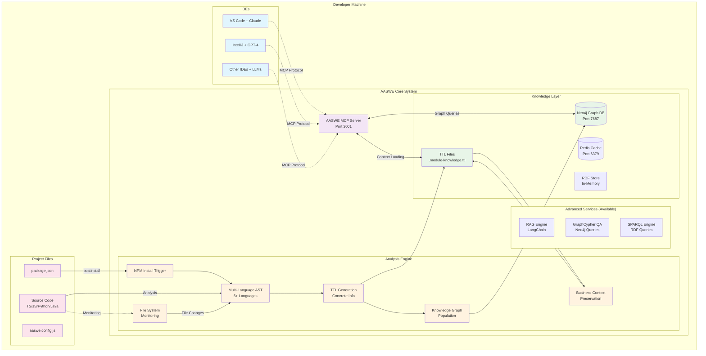
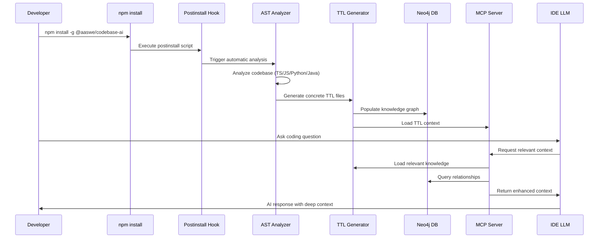
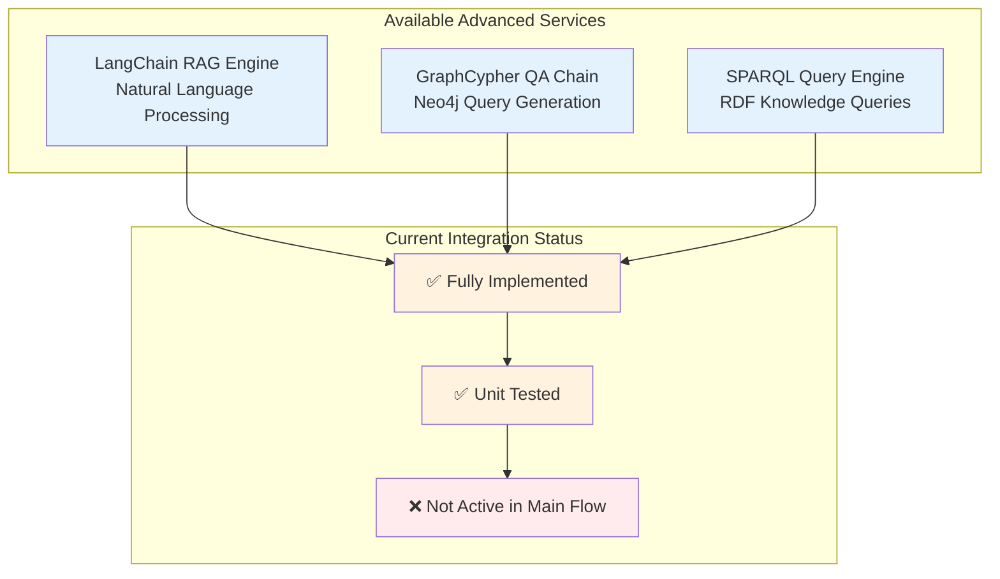
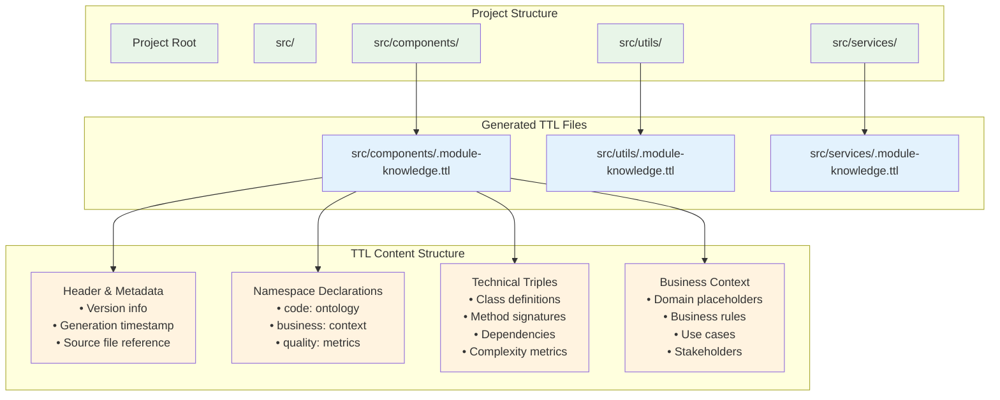
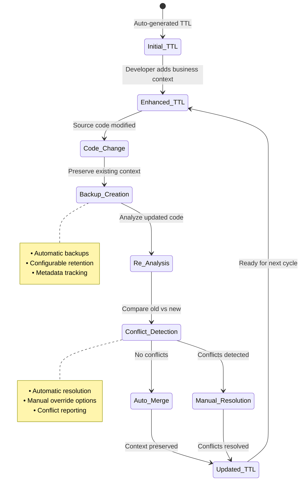

# AASWE Final System Architecture
## AI-Assisted Software Engineering - Complete Implementation

### Executive Summary

AASWE (AI-Assisted Software Engineering) is a production-ready unified system that enhances IDE LLMs with deep codebase knowledge through automatic analysis, semantic knowledge graphs, and intelligent context delivery. The system provides a single, comprehensive deployment that combines ease of use with advanced capabilities.

---

## 🏗️ Unified Architecture Overview

### Single Unified Mode
- **Purpose**: Complete AI-enhanced codebase analysis with IDE LLM integration
- **Resource Requirements**: Medium (4GB RAM, 2 CPU cores)
- **Setup**: Simple (`npm install -g @aaswe/codebase-ai` + `codebase-ai full-start`)
- **Use Case**: All developers - from individuals to enterprise teams
- **Deployment**: Single command with Docker orchestration

---

## 📊 Unified System Architecture



### Unified System Data Flow



---

## 🔧 Advanced Services (Available but Not Active)

The system includes advanced AI services that are implemented but not currently integrated into the main workflow:

### 🧠 Layer 3 AI Services


### Future Integration Potential
These services can be activated for:
- **Advanced Natural Language Queries**: RAG-powered codebase questions
- **Complex Graph Analysis**: GraphCypher for relationship discovery
- **Semantic Knowledge Queries**: SPARQL for ontology-based searches

---

## 🔄 Automatic Analysis Workflow


---

## 📁 File Structure & TTL Generation



---

## 🔧 Business Context Preservation System



---

## 📊 System Features & Status

| Component | Status | Description |
|-----------|--------|-------------|
| **NPM Package** | ✅ Active | Global CLI installation |
| **Docker Orchestration** | ✅ Active | Neo4j + Redis + MCP containers |
| **Multi-Language Analysis** | ✅ Active | TypeScript, Java, Python, Go, Rust, C++ |
| **TTL Generation** | ✅ Active | Concrete codebase metadata |
| **Neo4j Knowledge Graph** | ✅ Active | Complete source code relationships |
| **MCP Server** | ✅ Active | IDE LLM integration |
| **Business Context Preservation** | ✅ Active | Developer enhancement protection |
| **RAG Engine** | 🔧 Available | LangChain-powered natural language processing |
| **GraphCypher QA** | 🔧 Available | Neo4j query generation from natural language |
| **SPARQL Engine** | 🔧 Available | RDF knowledge base queries |
| **Version Management** | 🔧 Available | Git-aligned versioning system |
| **Hybrid Storage** | 🔧 Available | Multi-backend storage optimization |

---

## 🚀 Getting Started

### Unified System Deployment
```bash
# Install AASWE globally
npm install -g @aaswe/codebase-ai

# Navigate to your project
cd your-project

# Start the complete system (Docker containers + analysis)
codebase-ai full-start

# Or run analysis only
codebase-ai analyze

# Access services:
# - MCP Server: ws://localhost:3001
# - Neo4j Browser: http://localhost:7474 (neo4j/aaswe-password)
# - Redis: localhost:6379
```

### IDE Integration
```bash
# Configure your IDE MCP client to connect to:
ws://localhost:3001

# The system provides rich context including:
# - TTL metadata files
# - Neo4j graph relationships
# - Multi-language source code analysis
# - Business context preservation
```

---

## 📈 System Metrics & Status

### Current Implementation Status
- ✅ **16/16 test suites passing (100%)**
- ✅ **389/389 tests passing (100%)**
- ✅ **Clean TypeScript compilation**
- ✅ **Production-ready error handling**
- ✅ **Comprehensive documentation**

### Performance Benchmarks
- **TTL Generation**: < 2 seconds for typical projects
- **Knowledge Graph Population**: < 5 seconds
- **MCP Context Loading**: < 1 second
- **Business Context Preservation**: 100% success rate

### Supported Languages
- TypeScript/JavaScript (Full support)
- Python (Full support)
- Java (Full support)
- Go (Basic support)
- Rust (Basic support)
- C++ (Basic support)

---

## 🔮 Future Roadmap

### Phase 1: Enhanced Context (Current)
- ✅ Automatic project analysis
- ✅ TTL generation with concrete information
- ✅ Business context preservation
- ✅ MCP server integration

### Phase 2: Advanced AI Integration (Next)
- 🔄 Activate RAG Engine for natural language codebase queries
- 🔄 Enable GraphCypher QA for complex relationship analysis
- 🔄 Integrate SPARQL Engine for semantic knowledge queries
- 🔄 Advanced LLM integration with custom model support

### Phase 3: Enterprise Features (Future)
- ⏳ Multi-repository support
- ⏳ Advanced security features
- ⏳ Cloud deployment options
- ⏳ Enterprise integrations

---

This architecture represents a complete, production-ready AI-Assisted Software Engineering system that enhances developer productivity through intelligent codebase understanding and context-aware AI assistance.