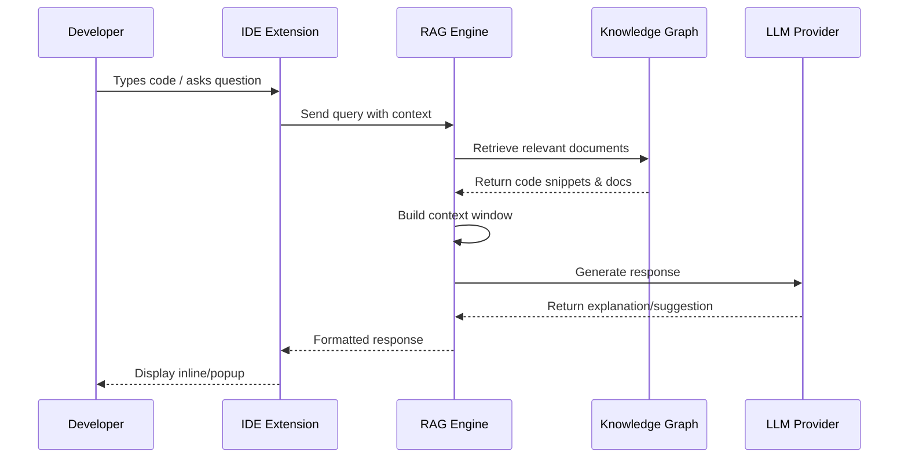

# LangChain RAG Engine

A production-ready Retrieval-Augmented Generation (RAG) engine built with LangChain for context-aware code assistance and intelligent developer interactions.

## Overview

The RAG Engine provides semantic search over code knowledge graphs, intelligent context management, and multi-provider LLM integration to deliver accurate, contextual responses to developer queries.

## Architecture

```
┌─────────────────┐    ┌──────────────────┐    ┌─────────────────┐
│   Developer     │    │   RAG Engine     │    │   Knowledge     │
│      IDE        │◄──►│                  │◄──►│     Graph       │
│                 │    │  ┌─────────────┐ │    │                 │
│  • VS Code      │    │  │ Context     │ │    │  • Neo4j        │
│  • IntelliJ     │    │  │ Manager     │ │    │  • RDF Store    │
│  • Cursor       │    │  └─────────────┘ │    │  • Vector DB    │
│  • Any Editor   │    │  ┌─────────────┐ │    │                 │
└─────────────────┘    │  │ LLM Gateway │ │    └─────────────────┘
                       │  └─────────────┘ │
                       │  ┌─────────────┐ │
                       │  │ Semantic    │ │
                       │  │ Search      │ │
                       │  └─────────────┘ │
                       └──────────────────┘
```

## Core Components

### 1. RAGEngine
The main orchestrator that coordinates retrieval, context building, and response generation.

**Key Features:**
- Multi-provider LLM support (OpenAI, Anthropic, local models)
- Semantic search with configurable similarity thresholds
- Response caching and optimization
- Comprehensive metrics and monitoring
- Production-ready error handling

### 2. ContextManager
Intelligent context window management for optimal LLM performance.

**Key Features:**
- Dynamic context window sizing
- Priority-based document ranking
- Automatic context expiration
- Memory-efficient storage
- Context chain tracking for conversations

### 3. Multi-Provider LLM Integration
Unified interface supporting multiple LLM providers with failover capabilities.

**Supported Providers:**
- **OpenAI**: GPT-3.5, GPT-4, GPT-4 Turbo
- **Anthropic**: Claude 3 Haiku, Sonnet, Opus
- **Local Models**: Ollama, LM Studio, custom endpoints

## IDE Integration Workflow

### Real-Time Developer Assistance



### Integration Scenarios

#### 1. **Code Explanation**
```typescript
// Developer hovers over complex function
const queryContext: QueryContext = {
  query: "What does this function do?",
  intent: "code_explanation",
  scope: "file",
  language: "typescript",
  filePath: "/src/utils/dataProcessor.ts",
  codeSelection: {
    startLine: 45,
    endLine: 67,
    content: "function processComplexData(data) { ... }"
  }
};

// RAG Engine provides contextual explanation
const response = await ragEngine.query(queryContext);
// Returns: Detailed explanation with examples and related patterns
```

#### 2. **Bug Detection & Fixing**
```typescript
// Developer encounters error
const queryContext: QueryContext = {
  query: "TypeError: Cannot read property 'length' of undefined",
  intent: "bug_fix",
  scope: "file",
  language: "javascript",
  filePath: "/src/components/UserList.js",
  codeSelection: {
    startLine: 23,
    endLine: 25,
    content: "users.map(user => user.name).length"
  }
};

// RAG Engine analyzes context and suggests fixes
const response = await ragEngine.query(queryContext);
// Returns: Root cause analysis + multiple fix suggestions + prevention tips
```

#### 3. **Feature Implementation**
```typescript
// Developer needs to implement new feature
const queryContext: QueryContext = {
  query: "How do I add user authentication to this React app?",
  intent: "feature_request",
  scope: "project",
  language: "typescript",
  userPreferences: {
    verbosity: "comprehensive",
    includeExamples: true,
    includeReferences: true
  }
};

// RAG Engine provides step-by-step implementation guide
const response = await ragEngine.query(queryContext);
// Returns: Architecture suggestions + code examples + best practices + testing strategies
```

#### 4. **Code Refactoring**
```typescript
// Developer wants to improve code quality
const queryContext: QueryContext = {
  query: "How can I refactor this component to be more maintainable?",
  intent: "refactoring",
  scope: "file",
  language: "typescript",
  filePath: "/src/components/Dashboard.tsx"
};

// RAG Engine suggests improvements
const response = await ragEngine.query(queryContext);
// Returns: Refactoring suggestions + design patterns + performance optimizations
```

## IDE Extension Integration Points

### 1. **Hover Providers**
```typescript
// VS Code extension example
vscode.languages.registerHoverProvider('typescript', {
  async provideHover(document, position) {
    const word = document.getWordRangeAtPosition(position);
    const context = buildQueryContext(document, word);
    const response = await ragEngine.query(context);
    
    return new vscode.Hover(
      new vscode.MarkdownString(response.answer)
    );
  }
});
```

### 2. **Code Actions**
```typescript
// Provide quick fixes and refactoring suggestions
vscode.languages.registerCodeActionsProvider('*', {
  async provideCodeActions(document, range, context) {
    const diagnostics = context.diagnostics;
    const actions = [];
    
    for (const diagnostic of diagnostics) {
      const queryContext = {
        query: diagnostic.message,
        intent: "bug_fix",
        scope: "file",
        codeSelection: getCodeSelection(document, range)
      };
      
      const response = await ragEngine.query(queryContext);
      actions.push(createQuickFix(response));
    }
    
    return actions;
  }
});
```

### 3. **Completion Providers**
```typescript
// Intelligent code completion
vscode.languages.registerCompletionItemProvider('typescript', {
  async provideCompletionItems(document, position) {
    const context = analyzeCompletionContext(document, position);
    const queryContext = {
      query: `Complete this ${context.type}`,
      intent: "code_completion",
      scope: "file",
      language: document.languageId,
      codeSelection: context.selection
    };
    
    const response = await ragEngine.query(queryContext);
    return parseCompletionItems(response);
  }
});
```

### 4. **Chat Interface**
```typescript
// Integrated chat panel
class RAGChatProvider {
  async sendMessage(message: string, context: ChatContext) {
    const queryContext: QueryContext = {
      query: message,
      intent: this.detectIntent(message),
      scope: context.scope,
      language: context.activeLanguage,
      filePath: context.activeFile,
      previousContext: context.chatHistory
    };
    
    const response = await ragEngine.query(queryContext);
    
    // Update context chain for follow-up questions
    await contextManager.updateContextChain(
      context.sessionId, 
      queryContext, 
      response.answer
    );
    
    return {
      message: response.answer,
      sources: response.sources,
      suggestions: response.suggestions
    };
  }
}
```

## Configuration

### Basic Setup
```typescript
import { RAGEngine, ContextManager } from '@aide/codebase-ai';

const ragConfig: RAGConfig = {
  vectorStore: {
    type: 'memory', // or 'redis', 'neo4j'
    dimensions: 1536,
    similarity: 'cosine'
  },
  retrieval: {
    topK: 5,
    scoreThreshold: 0.7,
    maxTokens: 4000,
    contextWindow: 8000
  },
  llm: {
    provider: 'openai', // or 'anthropic', 'local'
    model: 'gpt-4-turbo-preview',
    temperature: 0.1,
    maxTokens: 2000
  },
  embeddings: {
    provider: 'openai',
    model: 'text-embedding-ada-002',
    dimensions: 1536
  },
  cache: {
    enabled: true,
    ttl: 300000, // 5 minutes
    maxSize: 1000
  }
};

const ragEngine = new RAGEngine(ragConfig);
```

### Advanced Configuration
```typescript
// Production configuration with multiple providers
const productionConfig: RAGConfig = {
  vectorStore: {
    type: 'neo4j',
    dimensions: 1536,
    similarity: 'cosine'
  },
  retrieval: {
    topK: 10,
    scoreThreshold: 0.75,
    maxTokens: 6000,
    contextWindow: 16000
  },
  llm: {
    provider: 'anthropic',
    model: 'claude-3-sonnet-20240229',
    temperature: 0.0,
    maxTokens: 4000
  },
  embeddings: {
    provider: 'openai',
    model: 'text-embedding-3-large',
    dimensions: 3072
  },
  cache: {
    enabled: true,
    ttl: 600000, // 10 minutes
    maxSize: 5000
  }
};
```

## Performance Optimization

### 1. **Context Window Management**
```typescript
const contextConfig: ContextManagerConfig = {
  maxContextWindows: 50,
  maxTokensPerWindow: 8000,
  defaultChunkSize: 1000,
  chunkOverlap: 200,
  priorityDecayRate: 0.01,
  cleanupInterval: 300000 // 5 minutes
};

const contextManager = new ContextManager(contextConfig);
```

### 2. **Caching Strategy**
- **Query-level caching**: Identical queries return cached responses
- **Context-level caching**: Frequently accessed code contexts stay in memory
- **LRU eviction**: Least recently used items are removed first
- **TTL expiration**: Automatic cleanup of stale cache entries

### 3. **Memory Management**
- **Streaming responses**: Large responses are streamed to reduce memory usage
- **Lazy loading**: Documents are loaded on-demand
- **Garbage collection**: Automatic cleanup of unused contexts
- **Memory monitoring**: Built-in metrics for memory usage tracking

## Monitoring & Metrics

### Built-in Metrics
```typescript
const metrics = await ragEngine.getMetrics();

console.log({
  queries: {
    total: metrics.queries.total,
    successful: metrics.queries.successful,
    failed: metrics.queries.failed,
    averageResponseTime: metrics.queries.averageResponseTime
  },
  retrieval: {
    averageDocuments: metrics.retrieval.averageDocuments,
    averageScore: metrics.retrieval.averageScore,
    cacheHitRate: metrics.retrieval.cacheHitRate
  },
  llm: {
    tokensUsed: metrics.llm.tokensUsed,
    averageTokensPerQuery: metrics.llm.averageTokensPerQuery,
    costEstimate: metrics.llm.costEstimate
  }
});
```

### Health Checks
```typescript
// Monitor system health
const healthCheck = {
  ragEngine: await ragEngine.isHealthy(),
  contextManager: contextManager.getContextStats(),
  vectorStore: await vectorStore.ping(),
  llmProvider: await llmProvider.healthCheck()
};
```

## Error Handling

### Graceful Degradation
```typescript
try {
  const response = await ragEngine.query(queryContext);
  return response;
} catch (error) {
  if (error instanceof RAGError) {
    switch (error.code) {
      case 'LLM_ERROR':
        // Fallback to simpler model or cached response
        return await fallbackResponse(queryContext);
      case 'RETRIEVAL_FAILED':
        // Use basic keyword search
        return await keywordSearch(queryContext);
      case 'CONTEXT_TOO_LARGE':
        // Reduce context size and retry
        return await retryWithSmallerContext(queryContext);
      default:
        return generateErrorResponse(error);
    }
  }
  throw error;
}
```

## Testing

### Unit Tests
```bash
npm test -- --testPathPatterns=langchain-rag.test.ts
```

### Integration Tests
```typescript
// Test with real LLM providers
describe('RAG Integration Tests', () => {
  test('should handle real OpenAI queries', async () => {
    const ragEngine = new RAGEngine(realConfig);
    const response = await ragEngine.query(testQuery);
    expect(response.answer).toBeTruthy();
  });
});
```

## Deployment

### Docker Configuration
```dockerfile
FROM node:18-alpine
WORKDIR /app
COPY package*.json ./
RUN npm ci --only=production
COPY dist/ ./dist/
EXPOSE 3000
CMD ["node", "dist/index.js"]
```

### Environment Variables
```bash
# LLM Provider Configuration
OPENAI_API_KEY=your_openai_key
ANTHROPIC_API_KEY=your_anthropic_key

# Vector Store Configuration
NEO4J_URI=bolt://localhost:7687
NEO4J_USER=neo4j
NEO4J_PASSWORD=password

# Cache Configuration
REDIS_URL=redis://localhost:6379

# Monitoring
METRICS_ENABLED=true
LOG_LEVEL=info
```

## Best Practices

### 1. **Context Optimization**
- Keep context windows focused and relevant
- Use appropriate chunk sizes for your content
- Implement proper context expiration policies

### 2. **Query Design**
- Structure queries with clear intent
- Provide sufficient context for accurate responses
- Use appropriate scope settings

### 3. **Performance Tuning**
- Monitor token usage and costs
- Implement appropriate caching strategies
- Use streaming for large responses

### 4. **Security**
- Sanitize user inputs
- Implement rate limiting
- Use secure API key management
- Audit sensitive code access

## Troubleshooting

### Common Issues

#### High Memory Usage
```typescript
// Monitor and optimize context usage
const stats = contextManager.getContextStats();
if (stats.memoryUsage > threshold) {
  await contextManager.clearExpiredContexts();
}
```

#### Slow Response Times
```typescript
// Optimize retrieval settings
const optimizedConfig = {
  ...config,
  retrieval: {
    ...config.retrieval,
    topK: 3, // Reduce retrieved documents
    scoreThreshold: 0.8 // Increase quality threshold
  }
};
```

#### Token Limit Exceeded
```typescript
// Implement context truncation
const truncatedContext = await contextManager.getRelevantContext(
  queryContext,
  maxTokens * 0.7 // Leave room for response
);
```

## Contributing

1. Fork the repository
2. Create a feature branch
3. Add comprehensive tests
4. Update documentation
5. Submit a pull request

## License

MIT License - see LICENSE file for details.